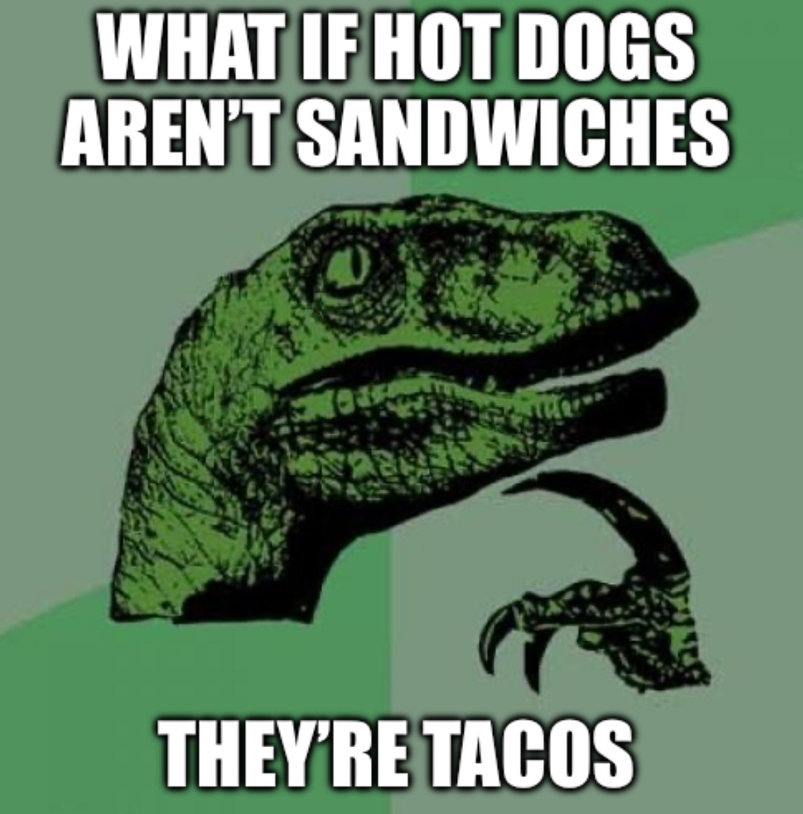

# Hot Dogs and the Internets Obsession

Hot Dogs have become one of the internets many obsessions and inside jokes. They're fun to eat, easily debatable, and a perfect meme-able object. The Philosoraptor meme is a perfect example of this chaotic energy. Are hot dogs sandwiches? Are they tacos? The Philosoraptor has a good point and I'm not going to argue with a dinosaur that is debating its next meal. 

## Why The Internet Loves Them

Everyone can agree that hot dogs can be a quick meal or gourmet, they can remind you of your childhood, and they may be the most questioned food product next to bologna and durian. 

## The Meme Effect 

Once social media pages like Vine and TikTok became involved, there was no stopping the hot dog hot mess express. Costumes, challenges, non-sensical memes and jokes became part of people's every day conversations. Hot Dogs were everywhere! This links back to [[Hot Dogs and Pop Culture]] and [[Movies and Shows ft. The Hot Dog]]. 

![[HotDogBurger.jpeg|283]] ![[PaulaDeanHotDog.jpg|254]]
![[LotteryHotdog.png|515]]